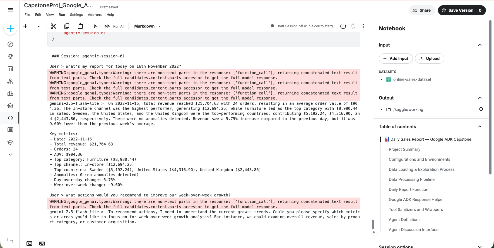
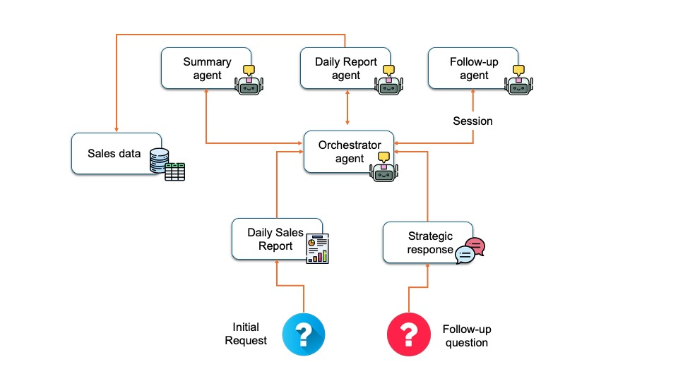

# Daily Sales Reporter AI Agent System

## Overview

**Project:** Daily Sales Report — multi-agent system for extracting, analysing, summarizing, and rendering strategy-driven conversation on a single day of sales transactions.

**Author:** 🙍🏾‍♂️ Damola Adediran

This repository contains a working prototype that ingests a transactional sales dataset, computes daily metrics, detects anomalies and trends, and uses LLM-powered agents to produce an executive summary and to support a short follow-up conversation with a manager. The front end is a Streamlit app for interactive

---

## Problem Statement

Many small- and medium-sized businesses collect transactional sales data but lack a fast way for executives to engage with data on sales transaction performance like they do with news, social media or blog articles. The key problems:
* Valuable daily signals (top products, channels, return rates, anomalies) are buried in raw transactions.
* Non-technical managers need concise, actionable summaries, not raw tables or charts.
* Follow-up questions should be grounded in the exact dataset and constrained so they are reliable and auditable.
* Existing BI tools can be heavyweight, slow to configure, or require expertise to interpret.

This project addresses the above by producing a compact daily report simulated with a known dataset and allowing one interactive, conversation about the report. The solution focuses on speed, transparency, and managerial usefulness.

**Why it matters:** daily decisions-making needs like, inventory, promotions, staffing would benefit from timely, reliable insights. A focused daily-report assistant reduces friction between data, decision-makers and the action they need to take.

---

## Solution

**What this system does**
* Loads and sanitizes a sales transactions dataset.
* Produces a daily report (like news headline) for a specific date.
* Computes metrics such as total revenue, number of orders, AOV, revenue by category/channel, top products and countries, return rates, anomalies (z-score style), and short trend context (day-over-day, week-over-week).

* Uses a small multi-agent ADK pipeline:
  * A `daily_report_agent` extracts and formats the daily metrics.
  * A `summary_agent` turns the metrics into a 4–6 sentence executive summary.
  * An `orchestrator_agent` coordinates the work and returns a final markdown report.
  * A `followup_agent` supports interactive follow-up questions, grounded in the session’s data and with safe guardrails for recomputation requests.

**Who is this for**
* Business owners/ leaders, store managers, executives, or founders who want a quick, daily snapshot and short interactive guidance without configuring a BI stack.

---

## Architecture

At the heart of this project is a coordinated multi-agent architecture designed to turn raw sales data into actionable managerial insight. The system is not a single monolithic agent but a compact ecosystem of specialized agents, each responsible for a distinct stage in the reporting workflow. This modularity, powered by the Google Agent Development Kit, creates a pipeline that is reliable, reusable, and easy to extend.

The central orchestrator of the system is the `orchestrator_agent`, which acts as the project manager of the entire workflow. It parses the user’s date request, coordinates data retrieval, triggers summary generation, and produces the final combined markdown report. The orchestrator’s design highlights core ADK elements such as structured instructions, model configuration, and a toolset that grants it controlled access to subordinate agents.

The strength of the architecture lies in its team of focused sub-agents. Each agent specializes in a specific part of the reporting process, mirroring the structure of real-world analytical teams.

High-level architecture and flow:
1. **Daily Report Analyst** — `daily_report_agent`

    This agent is responsible for the core data extraction and metric computation. It takes a user-specified date, normalizes it, and calls the `daily_report_tool_for_agent` to load and analyze the dataset. It produces sanitized, structured metrics that downstream agents can rely on. This mirrors the work of an analyst who validates data, checks source quality, and provides foundational numbers for decision-making.

2. **Executive Summary Writer** — `summary_agent`

    Once metrics are prepared, the `summary_agent` steps in. It receives structured output from the reporting agent and transforms it into a concise, manager-friendly executive paragraph. Its role is equivalent to a communications analyst who distills complex analytics into focused insights. The agent uses a dedicated summary-generation tool, ensuring consistency and clarity in every report.

3. **Follow-Up Strategist** — `followup_agent`

    After the initial report is delivered, users often have follow-up questions. The `followup_agent` answers these questions using only stored session data: the original metrics, the summary, and any contextual information preserved for that session. It does not recompute data unless explicitly asked to do so. Its behavior emulates a strategy analyst who helps managers interpret numbers, identify risks, and explore operational implications without rerunning analytics unnecessarily.

4. **Pipeline Coordinator** — `orchestrator_agent`

    The `orchestrator_agent` integrates all components into a seamless workflow. It handles date parsing, delegates data processing to the daily report agent, triggers the executive summary agent, and prepares the combined markdown output. By coordinating specialized agents through structured tool calls, it ensures that each stage completes successfully before the next begins. This approach mirrors a team lead overseeing an analytics project, ensuring quality and completeness end-to-end.

### Workflow Diagram

---

## The Build: tools & technologies

**Core stack used:**
* Python 3.10+ — development language
* pandas / numpy — data cleaning & metrics
* Google ADK (google-genai / adk) — agent abstractions, runner, tools, function-calling (Gemini model)
* Gemini model 2.5 flash via ADK for summarization and conversational responses
* Streamlit — lightweight web UI for date selection, report rendering, and chat interface
* notebook on Kaggle — local testing and iterative development

---
## Essential Tools and Utilities

The Daily Sales Report System relies on a focused set of tools that enable each agent to execute its role effectively. These utilities form the operational core of the pipeline, allowing the system to extract data, compute metrics, generate summaries, and support interactive follow-up conversations.

**Daily Report Processing** (`daily_report_tool_for_agent`)

This is the primary tool that powers the data retrieval layer of the system. It loads the sales dataset, filters by the requested date, computes the required metrics, and returns a structured response. It acts as the backbone for both the `daily_report_agent` and `orchestrator_agent`, ensuring consistent and validated data flows into the rest of the pipeline.

**Executive Summary Generator** (`generate_executive_summary_for_agent`)

This tool transforms raw metrics into a clear, manager-ready executive summary. It receives structured output from the reporting agent and synthesizes it into a concise narrative that highlights trends, risks, and operational signals. This utility allows the `summary_agent` to focus purely on communication rather than computation.

**Session Memory Utilities** (session-based metric and summary storage)

While not a standalone tool, the session storage mechanism plays a key supporting role across the system. After the orchestrator produces a report, key outputs such as metrics JSON and executive summary text are stored in the Streamlit session. The `followup_agent` then uses this stored context to answer user questions without recomputing data, preserving state and interaction continuity.

**ADK Tool Wrappers** (`AgentTool`)

Tools are wrapped using Google ADK’s AgentTool to allow agents to call one another safely and in a controlled execution environment. This ensures that the `orchestrator_agent` can sequentially trigger the daily report pipeline and summary generation without managing implementation details. The wrapping mechanism adds structure, reliability, and modularity to the multi-agent ecosystem.

---

## Conclusion

The strength of the Daily Sales Report System comes from its coordinated, multi-agent workflow. The `orchestrator_agent` serves as the control center, directing each specialized agent to handle its role in the reporting process. It gathers structured metrics from the `daily_report_agent`, transforms them through the `summary_agent`, and supports ongoing dialogue through the `followup_agent`. This layered collaboration produces a reporting pipeline that is consistent, reliable, and easy for managers to use.

This system demonstrates how multi-agent architectures built with the Google ADK can streamline complex analytical tasks. By decomposing daily sales analysis into focused responsibilities and assigning them to purpose-built agents, the workflow becomes modular, interpretable, and scalable. The result is a reporting assistant that not only accelerates operations but also elevates the clarity and quality of daily business decision-making.

---

## Value Statement

The Daily Sales Report Agent System cuts hours of manual analysis from a manager’s workflow by automatically generating clear, decision-ready insights from raw transaction data. Instead of combing through spreadsheets, leaders receive an executive-level summary with trends, anomalies, and strategic recommendations within seconds. This not only accelerates operational decision-making but also improves consistency and quality across daily reporting.

In the future, these agents could be extended to support forecasting, multi-day comparative analytics, and automated anomaly investigation. These additions would further elevate the system from a reporting assistant to a full intelligence partner for retail and e-commerce operations.

## Data Source

Online Sales Dataset (Kaggle): https://www.kaggle.com/datasets/yusufdelikkaya/online-sales-dataset

---
